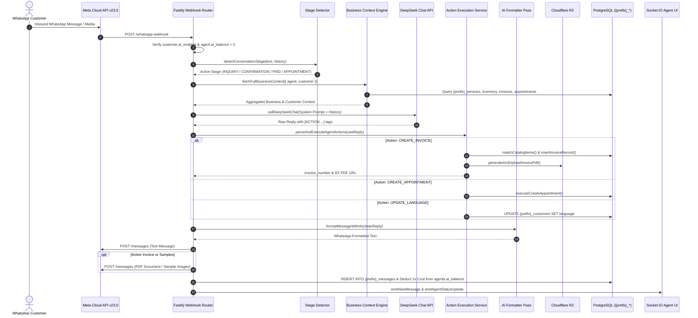

# Biz Agentz — Autonomous AI Agent Architecture & Technical Specification

## 1. System Overview

The **Biz Agentz AI Agent** is an autonomous, multi-tenant conversational sales and operations engine natively embedded into the WhatsApp Business CRM. Powered by DeepSeek (`deepseek-chat` / `deepseek-flash`), the agent represents tenant businesses across Sri Lanka in natural trilingual conversations (Sinhala, English, Tamil). It automates product and service inquiries, captures customer intent, schedules appointments, drafts catalog-grounded PDF invoices, and coordinates payment slip verification.

### Core Capabilities
- **Dual Operating Modes**: Fully autonomous real-time inbound reply via WhatsApp webhooks and on-demand agent copilot trigger via `/trigger-ai-response`.
- **Strict Multi-Tenant Isolation**: Enforces prefix-based table boundaries (`{agent_prefix}_*`), preventing cross-tenant leakage.
- **Dynamic 4-Stage Token Optimization**: Reduces input tokens by up to 60% (~650+ tokens in inquiry, ~1,200+ tokens on payment slips) by suppressing catalog context, invoice grounding, and pitch instructions when not applicable.
- **Autonomous Action Execution**: Directly executes transactional operations (PDF invoice generation, appointment booking, customer language preference updates) via structured action tags.
- **Optimized Formatting Pipeline**: Primary prompt formatting combined with high-speed deterministic WhatsApp sanitization (`sanitizeWhatsAppFormatting`), with optional opt-in secondary DeepSeek formatting (`ENABLE_AI_SECONDARY_FORMATTING=true`).
- **Automated Media Dispatch**: Automatically streams invoice PDFs and catalog sample images directly from Cloudflare R2 to WhatsApp.
- **Usage-Based Cost Accounting**: Real-time token metering with a 2.0x billing multiplier debited from `agents.ai_balance`.

---

## 2. End-to-End Conversation & Action Lifecycle



---

## 3. Multi-Tenant Isolation & Security Boundary

Multi-tenancy is enforced at the database query layer via dynamic table prefixes rather than shared rows with `tenant_id` filters.

### Prefix Validation Guardrail
All queries touching dynamic tenant tables must pass through [validateAgentPrefix](file:///c:/Github/whatsbi/backend/src/services/ai-business-context.ts#L17-L22):
```typescript
export function validateAgentPrefix(prefix: string): string {
  if (!prefix || typeof prefix !== 'string' || !/^[a-zA-Z0-9_]+$/.test(prefix)) {
    throw new Error(`[Multi-Tenant Security] Invalid or unsafe agent_prefix: "${prefix}"`);
  }
  return prefix;
}
```

### Dynamic Tables Queried by the AI Agent
1. **`{prefix}_messages`**: Last 12 messages loaded chronologically for conversation memory.
2. **`{prefix}_customers`**: Contact name, phone, language preference, pipeline stage, and `ai_enabled` toggle.
3. **`{prefix}_services` & `{prefix}_service_packages`**: Service tiers, package pricing, descriptions, and sample image URLs.
4. **`{prefix}_categories` & `{prefix}_inventory_items`**: Product inventory, SKUs, prices, stock levels, and WebP image URLs.
5. **`{prefix}_appointments`**: Existing appointments for this customer to prevent scheduling conflicts.
6. **`{prefix}_orders_invoices` & `{prefix}_orders_items`**: Customer payment and invoice history to enforce payment integrity.
7. **`{prefix}_orders`**: Active and completed orders.

---

## 4. Context Aggregation Engine

Context is assembled on demand by [fetchFullBusinessContext](file:///c:/Github/whatsbi/backend/src/services/ai-business-context.ts#L365-L425) prior to invoking the LLM:

| Context Component | Source | Max Bound | Purpose |
|---|---|---|---|
| **Company Overview** | `agents.company_overview` or R2 document | 3,000 chars | Business identity, policies, bank details, delivery terms. |
| **Custom Instructions** | `agents.ai_instructions` | 3,000 chars | Owner-defined operational rules (Highest Priority). |
| **Catalog Context** | Dynamic SQL (`_services` or `_inventory_items`) | Dynamic | Active packages/items, prices, and sample availability flags. |
| **Customer Records** | Dynamic SQL (`_appointments`, `_orders_invoices`) | Dynamic | Past booking dates, invoice balances, and order statuses. |
| **Bank Details** | Parsed via regex from company overview | Compact block | Account number, bank name, branch, account holder. |

### Zero-Record Context Pruning
When a customer has no prior bookings or invoices, [buildCustomerRecordsContext](file:///c:/Github/whatsbi/backend/src/services/ai-prompt-builder.ts#L32-L51) compresses the prompt to a single line:
```text
Customer Database Records for "Biz Name":
- No previous appointments, invoices, or orders on file.
```

---

## 5. Conversational Stage Detection & Token Optimization

To prevent token exhaustion and reduce operational inference costs, [detectConversationStage](file:///c:/Github/whatsbi/backend/src/services/ai-stage-detector.ts#L80-L105) categorizes the user message into one of four stages:

```
                  +-------------------------+
                  | Inbound Customer Intent |
                  +------------+------------+
                               |
            +------------------+------------------+
            |                  |                  |
     [Payment Slip?]   [Order Confirm?]   [Book Meeting?]
            |                  |                  |
           Yes                Yes                Yes
            |                  |                  |
            v                  v                  v
     +--------------+   +---------------+   +---------------+
     |  STAGE C:    |   |   STAGE B:    |   |   STAGE D:    |
     |     PAID     |   | CONFIRMATION  |   |  APPOINTMENT  |
     +--------------+   +---------------+   +---------------+
            |                  |                  |
            +--------+---------+--------+---------+
                     | No Matches
                     v
             +---------------+
             |   STAGE A:    |
             |    INQUIRY    |
             +---------------+
```

### Stage Workflow Specifications
- **Stage A (`INQUIRY`)**: Preliminary product/service exploration. Omits invoice schemas, bank account numbers, and 20-line invoice grounding rules. Reduces input size by ~650+ tokens. Concludes with a single confirmation question.
- **Stage B (`CONFIRMATION`)**: Triggered by explicit confirmation keywords in English, Sinhala, Singlish, or affirmative answers ("ow", "yes", "hari", "danna"). Renders consolidated invoice summary, bank transfer details, and appends `[ACTION:CREATE_INVOICE:{...}]`.
- **Stage C (`PAID`)**: Triggered when a payment slip image is sent or text states payment was made ("paid", "salli damma"). Warmly acknowledges receipt and informs the customer that the team will verify manually. Suppresses heavy product/service catalog context, pre-payment rules, and invoice generation, saving ~1,200+ tokens per slip.
- **Stage D (`APPOINTMENT`)**: Triggered by meeting or consultation keywords. Renders appointment confirmation and appends `[ACTION:CREATE_APPOINTMENT:{...}]` while omitting invoice calculation schemas.

---

## 6. Prompt Engineering & Linguistic Hygiene

The modular prompt is constructed by [buildChatbotSystemPrompt](file:///c:/Github/whatsbi/backend/src/services/ai-prompt-builder.ts#L189-L362):

### 1. Trilingual Spoken Language Rules
- **Sinhala**: Written exclusively in Sinhala script (සිංහල අකුරෙන්) using natural spoken language (කතා කරන සිංහල). Strict ban on formal textbook endings (e.g. bans "එවන්නෙමු", "කරන්නෙමු"; mandates "එවනවා", "කරනවා").
- **English**: Professional, warm, and direct.
- **Tamil**: Spoken natural Tamil script.
- **Strict Ban on Singlish**: Latin-script Sinhala is strictly prohibited in AI responses.

### 2. WhatsApp Formatting Rules
- Bold formatting must use single asterisks (`*bold*`). Triple asterisks (`***`) are strictly banned.
- Lists must use bullet dots (`•`). Asterisks (`*`) must never be used as bullets.
- Blank lines (`\n\n`) are required before and after lists and section headers (*Invoice:*, *Bank Details:*).
- Unbroken continuous sentences: Sentences must never be split across lines mid-phrase.
- Emojis are strictly banned in functional UI messages to maintain clean corporate hygiene.

### 3. Business Boundary Rules
- **Pre-Payment Boundary (Service Businesses)**: Creative briefs, scripts, raw video footage, and detailed project materials must NEVER be requested before payment. Pre-payment is strictly limited to agreeing on the package, price, and issuing the invoice.
- **Payment Integrity (Anti-Duplication)**: The model inspects `[PAID IN FULL]` items in customer records and is strictly prohibited from re-invoicing or recharging settled orders. Additional requests are treated as separate new orders.
- **Zero URL Leaks**: The model must never output invoice download URLs in chat text; PDFs are delivered exclusively as native WhatsApp document attachments.

---

## 7. Autonomous Action Engine & Schema Reconciliation

When DeepSeek emits action tags, [parseAndExecuteAgentActions](file:///c:/Github/whatsbi/backend/src/services/ai-agent-actions.service.ts#L199-L395) extracts the payload using balanced brace parsing:

### 1. Action Tag Signatures
```text
[ACTION:CREATE_INVOICE:{"name":"Invoice - Service","customer_name":"John","items":[{"name":"Basic Package","quantity":1,"price":15000}],"total_amount":15000,"advance_amount":0,"notes":"Delivery details"}]

[ACTION:UPDATE_INVOICE:{"invoice_id":123,"name":"Invoice - Service","items":[{"name":"Basic Package","quantity":2,"price":15000}],"total_amount":30000,"advance_amount":0,"notes":"Updated qty"}]

[ACTION:CREATE_APPOINTMENT:{"title":"Consultation","appointment_date":"2026-09-20T10:00:00+05:30","duration_minutes":60,"notes":"Zoom call"}]

[ACTION:UPDATE_APPOINTMENT:{"appointment_id":45,"title":"Consultation","appointment_date":"2026-09-21T15:00:00+05:30","duration_minutes":60,"notes":"Rescheduled"}]

[ACTION:UPDATE_LANGUAGE:{"language":"english"}]

[ACTION:UPDATE_LEAD_STAGE:{"lead_stage":"Contacted","interest_stage":"Interested","conversion_stage":"Payment Pending"}]
```

### 2. Invoice Creation & In-Place Update Pipeline (`executeCreateInvoice` & `updateInvoiceWithPdfRegeneration`)
1. **Confirmation Guardrail**: The agent confirms order details, quantity, and pricing with the customer in Stage A before creating an invoice in Stage B.
2. **Existing Invoice Detection (No Duplicates)**: Before inserting a new invoice, the system checks for existing active unpaid invoices (`status IN ('generated', 'sent')`) for the customer. If found, or if an update was requested (`UPDATE_INVOICE`), it mutates the existing invoice in place.
3. **Database Transaction**: Updates `{prefix}_orders_invoices` (amounts, name, notes, status) and replaces line items in `{prefix}_orders_items`.
4. **PDF Regeneration & R2 Media Cleanup**: Regenerates the PDF with the latest details via [updateInvoiceWithPdfRegeneration](file:///c:/Github/whatsbi/backend/src/services/invoice-edit.service.ts), uploads the fresh PDF to Cloudflare R2, updates `pdf_url`, and purges the obsolete old PDF from Cloudflare R2 storage.
5. **Placeholder Replacement**: Replaces `{{INVOICE_NUMBER}}` in message text with the real invoice code.
6. **Action Strip**: Removes `[ACTION:...]` blocks and JSON tails via [sanitizeLeakedActionArtifacts](file:///c:/Github/whatsbi/backend/src/services/ai-agent-schema.ts).

### 3. Customer Lead Stage Progression & Authentic Paid Conversion Boundary (`ai-lead-stage.service.ts`)
1. **Autonomous Progression**:
   - Engagement: When an inbound message from a `'New Lead'` is answered by the AI agent, `lead_stage` automatically transitions to `'Contacted'`.
   - Interest: When exploring catalog packages or products, `interest_stage` advances to `'Interested'`.
   - Invoicing: Creating an invoice transitions `interest_stage` to `'Quotation Sent'` and `conversion_stage` to `'Payment Pending'` (unless already `'Paid'`).
   - Payment Slip / Reported Paid: Acknowledges receipt and keeps/sets stage as `'Payment Pending'`.
2. **Strict Authentic Paid Conversion Boundary**:
   - The AI Agent is **strictly forbidden** from setting `conversion_stage` to `'Paid'`.
   - Only a human team member manually verifying the bank transfer and marking the order or invoice as paid in the CRM establishes the definitive `'Paid'` lead stage.
   - Once a customer is marked `'Paid'`, the AI Agent treats them as an officially converted paying client and **never downgrades or resets** their conversion stage.
3. **Action Tag Execution (`UPDATE_LEAD_STAGE`)**:
   - DeepSeek can explicitly emit `[ACTION:UPDATE_LEAD_STAGE:{"lead_stage":"Contacted","interest_stage":"Interested"}]`.
   - All values are validated against database ENUMs (`lead_stage_enum`, `interest_stage_enum`, `conversion_stage_enum`).
   - Database mutations are broadcast via Socket.IO (`lead_stage_updated`) to update connected agent inboxes in real time.

### 4. Appointment Booking & Rescheduling Pipeline (`executeCreateAppointment` & `executeUpdateAppointment`)
1. **Confirmation Guardrail**: If date/time is not provided, the agent asks for preferred times. When confirmed, an appointment is scheduled.
2. **Existing Appointment Detection (No Duplicates)**: If the customer already has an active pending/confirmed appointment, or requests a reschedule (`UPDATE_APPOINTMENT`), [executeCreateAppointment](file:///c:/Github/whatsbi/backend/src/services/ai-agent-db.ts) delegates to `executeUpdateAppointment`, mutating the existing row rather than inserting duplicate appointments.
3. **Resilient Date/Time Parsing**: [parseAppointmentDateTime](file:///c:/Github/whatsbi/backend/src/services/ai-agent-db.ts) resolves ISO formats, relative days ("today", "tomorrow", "day after tomorrow", Sinhala "අද"/"හෙට"/"අනිද්දා", Singlish "heta"/"ada"), weekday names, and 12h/24h timestamps anchored to **Asia/Colombo (UTC+5:30)**.
4. **Multi-Turn Contextual Stage Persistence**: [isAppointmentIntent](file:///c:/Github/whatsbi/backend/src/services/ai-stage-detector.ts) checks previous assistant messages for scheduling questions so customer temporal replies ("Tomorrow at 10 AM", "හෙට උදේ 10ට") automatically stay in Stage D instead of resetting to inquiry.
5. **Fallback Appointment Creation**: [detectAndGenerateFallbackAppointment](file:///c:/Github/whatsbi/backend/src/services/ai-agent-db.ts) automatically extracts confirmed appointments from the text reply if the model omits the `[ACTION:CREATE_APPOINTMENT]` tag.
6. **Real-Time Notification**: Emits `appointment_created` or `appointment_updated` via Socket.IO (`emitAgentStatusUpdate`) to refresh the dashboard and appointment list in real time.

---

## 8. High-Performance Formatting & Media Dispatch

To guarantee pristine WhatsApp presentation while eliminating redundant LLM token expenditures:

```
[DeepSeek Generation] ──> [Action Parser] ──> [Deterministic Sanitizer (0 Tokens)] ──> [Meta Cloud API]
                                                         │
                                             sanitizeWhatsAppFormatting()
                                             Bold (*bold*), Bullets (•), Spacing
                                             Zero-latency instant processing
```

By default, [formatMessageWithAI](file:///c:/Github/whatsbi/backend/src/services/ai-formatters.ts#L323-L411) uses the high-performance deterministic sanitizer [sanitizeWhatsAppFormatting](file:///c:/Github/whatsbi/backend/src/services/ai-formatters.ts#L100-L152), eliminating ~700–1,200 tokens of secondary LLM usage and 5–15 seconds of latency on every inbound message. A secondary DeepSeek pass can be enabled via `ENABLE_AI_SECONDARY_FORMATTING=true` or `{ forceAi: true }`.

### Automated Media Dispatch
After the text message is dispatched, [handleInboundMessage](file:///c:/Github/whatsbi/backend/src/services/ai-chatbot.service.ts#L289-L495) handles automated media:
1. **Invoice PDF Dispatch**: If an invoice was generated, [dispatchCustomerInvoicePdf](file:///c:/Github/whatsbi/backend/src/services/whatsapp-outbound.service.ts) sends the R2 PDF as an official WhatsApp document attachment.
2. **Sample Image Dispatch**: If the customer requested samples and catalog items contain R2 media URLs, [dispatchServiceSampleImages](file:///c:/Github/whatsbi/backend/src/services/whatsapp-outbound.service.ts) dispatches up to 3 sample images.
3. **Real-Time UI Update**: Emits `emitNewMessage` over Socket.IO to instantly update the agent's web inbox.
4. **Cache Invalidation**: Invalidates Redis conversation and chat list caches via `CacheService`.

---

## 9. Token Accounting & Billing Model

AI usage is metered per message by [ai-cost.service.ts](file:///c:/Github/whatsbi/backend/src/services/ai-cost.service.ts) using official DeepSeek token pricing:

### Pricing Ledger (USD per 1M Tokens)
| Model | Prompt Cache Hit | Prompt Cache Miss | Completion Output |
|---|---|---|---|
| `deepseek-chat` | $0.070 | $0.270 | $1.100 |
| `deepseek-flash` | $0.015 | $0.150 | $0.600 |

### Multiplier & Balance Deduction
- **Billing Multiplier**: 2.0x of actual DeepSeek API expense (`chargedCost = actualCost * 2.0`).
- **Atomic Deduction**:
  ```sql
  UPDATE agents SET ai_balance = GREATEST(0, ai_balance - $1) WHERE id = $2 RETURNING ai_balance;
  ```
- **Real-Time Event**: Emits `ai_balance_updated` over Socket.IO to refresh the credit pill in the agent UI.
- **Balance Exhaustion**: If `ai_balance <= 0`, autonomous replies are halted and incoming messages remain in the unassigned inbox for human agent pickup.

---

## 10. API Route Reference

| Endpoint | Method | Auth | Description |
|---|---|---|---|
| `/trigger-ai-response` | `POST` | Bearer JWT | Copilot trigger: Generates and optionally sends an AI reply for a specific customer. |
| `/whatsapp-webhook` | `POST` | Meta Signature | Ingests inbound WhatsApp messages and triggers autonomous AI responses. |
| `/chatbot-reply` | `POST` | `CHATBOT_SECRET` | Webhook gateway allowing external automated bots to dispatch customer replies. |
| `/bot-context/:customerId` | `GET` | Bearer JWT | Exports aggregated business, catalog, and customer context for external agents. |

---

## 11. Testing & Verification Runbook

For manual verification procedures, refer to [test-cases.md](file:///c:/Github/whatsbi/docs/test-cases.md) and [testing.md](file:///c:/Github/whatsbi/docs/testing.md):
- **TC-AI-01**: Multi-Tenant Prefix Isolation & SQL Injection Defense.
- **TC-AI-02**: Customer Database Context Scoping & Zero Cross-Tenant Leakage.
- **TC-AI-03**: Universal Business Phrasing (Product vs Service context).
- **TC-AI-04**: Product Stock Checking & Delivery Address Capture.
- **TC-AI-05**: AI Custom Instructions & Business Rules Overrides.
- **TC-AI-06**: AI Message Formatting & Strict Ban on Singlish/Emojis.
- **TC-AI-07**: Customer Language Switching & Persistence (`UPDATE_LANGUAGE`).
- **TC-AI-08**: Dual-Stage AI Formatting Pipeline & Sentence Preservation.
- **TC-AI-09**: Customer Lead Stage Autonomous & Action-Driven Progression (`UPDATE_LEAD_STAGE`).
- **TC-AI-10**: Team Manual Verification & Authentic Paid Conversion Integrity Boundary.
