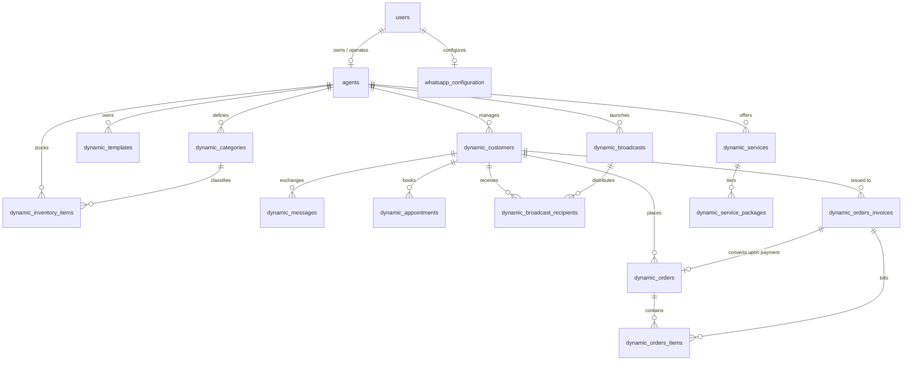

# Biz Agentz Database Architecture & Schema Specification

This document provides the definitive architectural blueprint, schema specification, multi-tenancy model, stored procedure catalog, indexing strategy, and migration history for the Biz Agentz PostgreSQL database.

---

## 1. Architectural Overview & Multi-Tenancy Strategy

Biz Agentz implements an **isolated dynamic table multi-tenancy pattern** within PostgreSQL 15. Instead of housing all tenant records in shared tables with single tenant-id columns, each agent (business tenant) is allocated an isolated set of dynamic tables identified by a unique alphanumeric prefix:

$$\text{Table Name} = \{\text{agent\_prefix}\} \_ \{\text{entity\_name}\}$$

Example for agent prefix `agt_a1b2`:
- `agt_a1b2_customers`
- `agt_a1b2_messages`
- `agt_a1b2_orders`
- `agt_a1b2_orders_items`
- `agt_a1b2_orders_invoices`
- `agt_a1b2_appointments`
- `agt_a1b2_templates`
- `agt_a1b2_categories`
- `agt_a1b2_inventory_items`
- `agt_a1b2_services`
- `agt_a1b2_service_packages`
- `agt_a1b2_broadcasts`
- `agt_a1b2_broadcast_recipients`
- `agt_a1b2_customer_groups`
- `agt_a1b2_customer_group_members`

### Benefits of the Dynamic Table Architecture
1. **Strict Data Isolation**: Zero risk of inadvertent data leaks between businesses across CRM conversations and orders.
2. **Independent Table Maintenance**: Indexes, vacuums, and archiving can occur per tenant without table-locking unrelated businesses.
3. **Automated Lifecycle**: A PostgreSQL trigger executes on `INSERT INTO agents`, generating all 13 dynamic tables instantly. Deletion of an agent executes dynamic dropping of the associated tables.
4. **Row-Level Security (RLS)**: Enforced via PostgreSQL policies ensuring that authenticated users can only query their own agent-scoped tables.

---

## 2. Entity-Relationship Diagram (ERD)



---

## 3. Global System Tables

Global system tables manage authentication, global administration, agent registration, and external Meta Graph API credentials.

### 3.1. `users` Table
Stores authentication credentials, roles, and administrative flags.

```sql
CREATE TABLE users (
    id UUID PRIMARY KEY DEFAULT gen_random_uuid(),
    name VARCHAR(255) NOT NULL,
    email VARCHAR(255) UNIQUE NOT NULL,
    role role DEFAULT 'agent',
    password_hash TEXT NOT NULL,
    agent_id BIGINT REFERENCES agents(id) ON DELETE SET NULL,
    created_at TIMESTAMPTZ DEFAULT now(),
    updated_at TIMESTAMPTZ DEFAULT now()
);
```

| Column | Type | Constraints | Description |
|---|---|---|---|
| `id` | UUID | PRIMARY KEY | Unique user identifier |
| `name` | VARCHAR(255) | NOT NULL | User's full display name |
| `email` | VARCHAR(255) | UNIQUE, NOT NULL | Login email address |
| `role` | role (ENUM) | DEFAULT 'agent' | 'admin' or 'agent' |
| `password_hash` | TEXT | NOT NULL | Bcrypt salted password hash |
| `agent_id` | BIGINT | FK -> agents(id) | Associated agent business account |
| `created_at` | TIMESTAMPTZ | DEFAULT now() | Creation timestamp |
| `updated_at` | TIMESTAMPTZ | DEFAULT now() | Last update timestamp |

---

### 3.2. `agents` Table
Master record for each business account, defining prefix, catalog type, and AI credit balances.

```sql
CREATE TABLE agents (
    id BIGSERIAL PRIMARY KEY,
    agent_prefix VARCHAR(20) UNIQUE NOT NULL,
    user_id UUID NOT NULL REFERENCES users(id) ON DELETE CASCADE,
    created_by UUID REFERENCES users(id) ON DELETE SET NULL,
    name TEXT NOT NULL,
    email TEXT NOT NULL,
    role TEXT DEFAULT 'agent',
    business_type TEXT DEFAULT 'product',
    credits NUMERIC(10, 2) DEFAULT 1.00,
    ai_balance NUMERIC(14, 6) DEFAULT 4.000000,
    invoice_template_path TEXT,
    company_overview_path TEXT,
    webhook_url TEXT,
    created_at TIMESTAMPTZ DEFAULT now(),
    updated_at TIMESTAMPTZ DEFAULT now()
);
```

| Column | Type | Constraints | Description |
|---|---|---|---|
| `id` | BIGSERIAL | PRIMARY KEY | Unique agent identifier |
| `agent_prefix` | VARCHAR(20) | UNIQUE, NOT NULL | Namespace prefix (e.g. `agt_7f1a`) |
| `user_id` | UUID | FK -> users(id) | Primary user account owning this agent |
| `created_by` | UUID | FK -> users(id) | Admin user who provisioned the agent |
| `name` | TEXT | NOT NULL | Business or organization name |
| `email` | TEXT | NOT NULL | Contact email address |
| `role` | TEXT | DEFAULT 'agent' | Authorization role |
| `business_type` | TEXT | DEFAULT 'product' | 'product' (SKU-based) or 'service' (packages) |
| `credits` | NUMERIC(10, 2) | DEFAULT 1.00 | Available credits strictly for WhatsApp template messages ($0.01 per template broadcast). Admin-managed. |
| `ai_balance` | NUMERIC(14, 6) | DEFAULT 4.000000 | Available balance in USD for DeepSeek AI engine. Initial $4.00 USD for new agents. Backend silently deducts 2.0x raw DeepSeek API cost. Admin-managed. |
| `invoice_template_path`| TEXT | NULLABLE | Cloudflare R2 object key for invoice layout |
| `company_overview_path`| TEXT | NULLABLE | Cloudflare R2 key for company context doc |
| `webhook_url` | TEXT | NULLABLE | Optional external webhook endpoint (native AI handled via built-in DeepSeek model) |
| `created_at` | TIMESTAMPTZ | DEFAULT now() | Registration timestamp |
| `updated_at` | TIMESTAMPTZ | DEFAULT now() | Modification timestamp |

---

### 3.3. `whatsapp_configuration` Table
Stores Meta WhatsApp Cloud API credentials and webhook verification secrets.

```sql
CREATE TABLE whatsapp_configuration (
    id BIGSERIAL PRIMARY KEY,
    user_id UUID UNIQUE NOT NULL REFERENCES users(id) ON DELETE CASCADE,
    whatsapp_number VARCHAR(20) NOT NULL,
    phone_number_id VARCHAR(100) NOT NULL,
    business_account_id VARCHAR(100) NOT NULL,
    api_key TEXT NOT NULL,
    webhook_url TEXT,
    deepseek_api_key TEXT,
    verify_token TEXT NOT NULL,
    app_secret TEXT,
    is_active BOOLEAN DEFAULT true,
    created_at TIMESTAMPTZ DEFAULT now(),
    updated_at TIMESTAMPTZ DEFAULT now()
);
```

| Column | Type | Constraints | Description |
|---|---|---|---|
| `id` | BIGSERIAL | PRIMARY KEY | Configuration ID |
| `user_id` | UUID | UNIQUE, FK -> users | Single config per agent user |
| `whatsapp_number` | VARCHAR(20) | NOT NULL | Display WhatsApp phone number (E.164) |
| `phone_number_id` | VARCHAR(100) | NOT NULL | Meta Graph API Phone Number ID |
| `business_account_id` | VARCHAR(100) | NOT NULL | Meta WhatsApp Business Account ID (WABA) |
| `api_key` | TEXT | NOT NULL | Permanent Meta System User Access Token |
| `webhook_url` | TEXT | NULLABLE | Deprecated/Optional (AI handled natively by DeepSeek) |
| `deepseek_api_key` | TEXT | NULLABLE | Dedicated DeepSeek API key (1 per agent) for autonomous chatbot |
| `verify_token` | TEXT | NOT NULL | Shared secret for Meta webhook GET verification |
| `app_secret` | TEXT | NULLABLE | Meta App Secret for SHA256 signature validation |
| `is_active` | BOOLEAN | DEFAULT true | Toggles active webhook processing |
| `created_at` | TIMESTAMPTZ | DEFAULT now() | Registration timestamp |
| `updated_at` | TIMESTAMPTZ | DEFAULT now() | Modification timestamp |

---

### 3.4. `system_settings` Table
Platform-wide operational settings, global maintenance mode configuration, and webhook queuing policies.

```sql
CREATE TABLE system_settings (
    id VARCHAR(50) PRIMARY KEY,
    maintenance_mode BOOLEAN DEFAULT false,
    maintenance_title VARCHAR(255) DEFAULT 'System Maintenance Underway',
    maintenance_message TEXT DEFAULT 'We are currently performing scheduled maintenance to improve system stability. Services will resume shortly.',
    estimated_end VARCHAR(100),
    webhook_retry_mode BOOLEAN DEFAULT true,
    updated_at TIMESTAMPTZ DEFAULT now(),
    updated_by UUID REFERENCES users(id) ON DELETE SET NULL
);
```

| Column | Type | Constraints | Description |
|---|---|---|---|
| `id` | VARCHAR(50) | PRIMARY KEY | Configuration scope identifier (e.g. `'system'`) |
| `maintenance_mode` | BOOLEAN | DEFAULT false | Global flag gating non-admin access |
| `maintenance_title` | VARCHAR(255) | | Header text displayed on public maintenance screen |
| `maintenance_message`| TEXT | | Detailed explanation message for users |
| `estimated_end` | VARCHAR(100) | NULLABLE | Estimated completion time string or timestamp |
| `webhook_retry_mode`| BOOLEAN | DEFAULT true | When true, responds to `/whatsapp-webhook` with HTTP 503 + Retry-After: 60 |
| `updated_at` | TIMESTAMPTZ | DEFAULT now() | Timestamp of last settings modification |
| `updated_by` | UUID | FK -> users(id) | Super Admin who last updated settings |

---

## 4. Dynamic Per-Agent Tables

Whenever a new agent is registered, the procedure `create_agent_tables(p_agent_prefix, p_agent_id)` creates the following 13 tables under `public` schema.

### 4.1. `{prefix}_customers`
Customer relationship records, conversation timestamps, and CRM pipeline tracking.

```sql
CREATE TABLE {prefix}_customers (
    id SERIAL PRIMARY KEY,
    agent_id BIGINT NOT NULL REFERENCES agents(id) ON DELETE CASCADE,
    name TEXT NOT NULL,
    phone TEXT NOT NULL UNIQUE,
    profile_image_url TEXT,
    last_user_message_time TIMESTAMPTZ,
    ai_enabled BOOLEAN DEFAULT true,
    language TEXT DEFAULT 'sinhala',
    lead_stage lead_stage_enum DEFAULT 'New Lead',
    interest_stage interest_stage_enum,
    conversion_stage conversion_stage_enum,
    lead_stage_note TEXT,
    created_at TIMESTAMPTZ DEFAULT now()
);
```

### 4.2. `{prefix}_messages`
Bidirectional communication history with media references and read statuses.

```sql
CREATE TABLE {prefix}_messages (
    id SERIAL PRIMARY KEY,
    customer_id INTEGER NOT NULL REFERENCES {prefix}_customers(id) ON DELETE CASCADE,
    message TEXT NOT NULL,
    direction VARCHAR(10) NOT NULL CHECK (direction IN ('inbound', 'outbound')),
    timestamp TIMESTAMPTZ DEFAULT now(),
    is_read BOOLEAN DEFAULT false,
    media_type media_type DEFAULT 'none',
    media_url TEXT,
    caption TEXT
);
```

### 4.3. `{prefix}_orders`
Sales orders initiated during conversations or through agent booking.

```sql
CREATE TABLE {prefix}_orders (
    id SERIAL PRIMARY KEY,
    customer_id INTEGER NOT NULL REFERENCES {prefix}_customers(id) ON DELETE CASCADE,
    total_amount DECIMAL(10, 2) NOT NULL DEFAULT 0.00,
    advance_amount DECIMAL(10, 2) DEFAULT 0.00,
    estimated_delivery_date TIMESTAMPTZ,
    status VARCHAR(50) DEFAULT 'pending' CHECK (status IN ('pending', 'processing', 'shipped', 'delivered', 'completed', 'cancelled')),
    notes TEXT,
    shipping_address TEXT,
    created_at TIMESTAMPTZ DEFAULT now(),
    updated_at TIMESTAMPTZ DEFAULT now()
);
```

### 4.4. `{prefix}_orders_items`
Individual line items attached to a specific order or invoice.

```sql
CREATE TABLE {prefix}_orders_items (
    id SERIAL PRIMARY KEY,
    order_id INTEGER REFERENCES {prefix}_orders(id) ON DELETE CASCADE,
    invoice_id INTEGER REFERENCES {prefix}_orders_invoices(id) ON DELETE CASCADE,
    name TEXT NOT NULL,
    quantity INTEGER NOT NULL CHECK (quantity >= 1),
    price NUMERIC(10, 2) NOT NULL CHECK (price >= 0),
    total NUMERIC(10, 2) GENERATED ALWAYS AS (quantity * price) STORED
);
```

### 4.5. `{prefix}_orders_invoices`
Issued billing invoices and PDF storage paths. Supports the invoice-first flow (issued directly to a customer; converts to an order upon payment).

```sql
CREATE TABLE {prefix}_orders_invoices (
    id SERIAL PRIMARY KEY,
    order_id INTEGER REFERENCES {prefix}_orders(id) ON DELETE SET NULL,
    customer_id INTEGER REFERENCES {prefix}_customers(id) ON DELETE SET NULL,
    name TEXT NOT NULL,
    pdf_url TEXT,
    status VARCHAR(50) DEFAULT 'generated' CHECK (status IN ('generated', 'sent', 'paid')),
    discount_percentage DECIMAL(5, 2) DEFAULT 0.00 CHECK (discount_percentage >= 0 AND discount_percentage <= 100),
    total_amount NUMERIC(10, 2) DEFAULT 0.00,
    advance_amount NUMERIC(10, 2) DEFAULT 0.00,
    notes TEXT,
    generated_at TIMESTAMPTZ DEFAULT now(),
    updated_at TIMESTAMPTZ DEFAULT now()
);
```

### 4.6. `{prefix}_appointments`
Consultation and service bookings tied to customers.

```sql
CREATE TABLE {prefix}_appointments (
    id SERIAL PRIMARY KEY,
    customer_id INTEGER NOT NULL REFERENCES {prefix}_customers(id) ON DELETE CASCADE,
    title TEXT NOT NULL,
    appointment_date TIMESTAMPTZ NOT NULL,
    duration_minutes INTEGER DEFAULT 30 CHECK (duration_minutes >= 1 AND duration_minutes <= 1440),
    status VARCHAR(50) DEFAULT 'pending' CHECK (status IN ('pending', 'confirmed', 'completed', 'cancelled')),
    notes TEXT,
    created_at TIMESTAMPTZ DEFAULT now(),
    updated_at TIMESTAMPTZ DEFAULT now()
);
```

### 4.7. `{prefix}_templates`
Pre-approved or custom WhatsApp interactive message templates.

```sql
CREATE TABLE {prefix}_templates (
    id SERIAL PRIMARY KEY,
    agent_id BIGINT NOT NULL REFERENCES agents(id) ON DELETE CASCADE,
    name VARCHAR(100) NOT NULL,
    category message_category NOT NULL,
    language VARCHAR(10) DEFAULT 'en',
    body JSONB NOT NULL,
    is_active BOOLEAN DEFAULT true,
    created_at TIMESTAMPTZ DEFAULT now(),
    updated_at TIMESTAMPTZ DEFAULT now(),
    UNIQUE(agent_id, name)
);
```

### 4.8. `{prefix}_categories`
Product classification categories with UI color styling.

```sql
CREATE TABLE {prefix}_categories (
    id SERIAL PRIMARY KEY,
    name TEXT NOT NULL UNIQUE,
    description TEXT,
    color VARCHAR(7) DEFAULT '#22c55e',
    created_at TIMESTAMPTZ DEFAULT now()
);
```

### 4.9. `{prefix}_inventory_items`
SKU-based product catalog with inventory count and Cloudflare R2 media links.

```sql
CREATE TABLE {prefix}_inventory_items (
    id SERIAL PRIMARY KEY,
    agent_id BIGINT NOT NULL REFERENCES agents(id) ON DELETE CASCADE,
    name TEXT NOT NULL,
    description TEXT,
    quantity INTEGER NOT NULL DEFAULT 0 CHECK (quantity >= 0),
    price NUMERIC(10, 2) NOT NULL DEFAULT 0.00 CHECK (price >= 0),
    category_id INTEGER REFERENCES {prefix}_categories(id) ON DELETE SET NULL,
    sku VARCHAR(100),
    image_urls JSONB DEFAULT '[]'::jsonb,
    created_at TIMESTAMPTZ DEFAULT now(),
    updated_at TIMESTAMPTZ DEFAULT now()
);
```

### 4.10. `{prefix}_services`
Service business catalog with soft-delete capabilities.

```sql
CREATE TABLE {prefix}_services (
    id UUID PRIMARY KEY DEFAULT gen_random_uuid(),
    agent_id BIGINT NOT NULL REFERENCES agents(id) ON DELETE CASCADE,
    service_name VARCHAR(255) NOT NULL,
    description TEXT,
    service_links JSONB DEFAULT '[]'::jsonb,
    image_urls JSONB DEFAULT '[]'::jsonb,
    is_active BOOLEAN DEFAULT true,
    deleted_at TIMESTAMPTZ,
    created_at TIMESTAMPTZ DEFAULT now(),
    updated_at TIMESTAMPTZ DEFAULT now(),
    UNIQUE(agent_id, service_name)
);
```

### 4.11. `{prefix}_service_packages`
Tiered offerings for a service with distinct pricing and discount structures.

```sql
CREATE TABLE {prefix}_service_packages (
    id UUID PRIMARY KEY DEFAULT gen_random_uuid(),
    service_id UUID NOT NULL REFERENCES {prefix}_services(id) ON DELETE CASCADE,
    package_name VARCHAR(255) NOT NULL,
    price DECIMAL(10, 2) NOT NULL DEFAULT 0.00 CHECK (price >= 0),
    currency VARCHAR(10) DEFAULT 'LKR',
    discount DECIMAL(5, 2) DEFAULT 0.00,
    description TEXT,
    is_active BOOLEAN DEFAULT true,
    created_at TIMESTAMPTZ DEFAULT now(),
    updated_at TIMESTAMPTZ DEFAULT now(),
    UNIQUE(service_id, package_name)
);
```

### 4.12. `{prefix}_broadcasts`
Outbound broadcast campaign metadata and delivery telemetry.

```sql
CREATE TABLE {prefix}_broadcasts (
    id SERIAL PRIMARY KEY,
    agent_id BIGINT NOT NULL REFERENCES agents(id) ON DELETE CASCADE,
    name TEXT NOT NULL,
    template_id INTEGER REFERENCES {prefix}_templates(id) ON DELETE SET NULL,
    status VARCHAR(50) DEFAULT 'draft' CHECK (status IN ('draft', 'scheduled', 'processing', 'completed', 'failed')),
    scheduled_at TIMESTAMPTZ,
    completed_at TIMESTAMPTZ,
    total_recipients INTEGER DEFAULT 0,
    successful_count INTEGER DEFAULT 0,
    failed_count INTEGER DEFAULT 0,
    created_at TIMESTAMPTZ DEFAULT now()
);
```

### 4.13. `{prefix}_broadcast_recipients`
Individual recipient tracking for broadcast campaigns.

```sql
CREATE TABLE {prefix}_broadcast_recipients (
    id SERIAL PRIMARY KEY,
    broadcast_id INTEGER NOT NULL REFERENCES {prefix}_broadcasts(id) ON DELETE CASCADE,
    customer_id INTEGER REFERENCES {prefix}_customers(id) ON DELETE CASCADE,
    phone TEXT NOT NULL,
    status VARCHAR(50) DEFAULT 'pending' CHECK (status IN ('pending', 'sent', 'delivered', 'read', 'failed')),
    message_id TEXT,
    error_message TEXT,
    sent_at TIMESTAMPTZ
);
```

### 4.14. `{prefix}_customer_groups`
Customer segmentation groups with color badges and default CRM lead stage groups (`New Lead`, `Contacted`, `Follow-up Needed`, `Not Responding`).

```sql
CREATE TABLE {prefix}_customer_groups (
    id SERIAL PRIMARY KEY,
    agent_id BIGINT NOT NULL REFERENCES agents(id) ON DELETE CASCADE,
    name VARCHAR(100) NOT NULL,
    description TEXT,
    color VARCHAR(20) DEFAULT '#22C55E',
    is_default BOOLEAN DEFAULT false,
    created_at TIMESTAMPTZ DEFAULT now(),
    updated_at TIMESTAMPTZ DEFAULT now(),
    UNIQUE(agent_id, name)
);
```

### 4.15. `{prefix}_customer_group_members`
Many-to-many junction between customers and customer groups, automatically synchronized with `{prefix}_customers.lead_stage` via `trg_sync_lead_stage_{prefix}` PostgreSQL trigger.

```sql
CREATE TABLE {prefix}_customer_group_members (
    id SERIAL PRIMARY KEY,
    group_id INTEGER NOT NULL REFERENCES {prefix}_customer_groups(id) ON DELETE CASCADE,
    customer_id INTEGER NOT NULL REFERENCES {prefix}_customers(id) ON DELETE CASCADE,
    added_at TIMESTAMPTZ DEFAULT now(),
    UNIQUE(group_id, customer_id)
);
```

---

## 5. Enumerated Types (ENUMs)

```sql
CREATE TYPE role AS ENUM ('admin', 'agent');
CREATE TYPE lead_stage_enum AS ENUM ('New Lead', 'Contacted', 'Not Responding', 'Follow-up Needed');
CREATE TYPE interest_stage_enum AS ENUM ('Interested', 'Quotation Sent', 'Asked for More Info');
CREATE TYPE conversion_stage_enum AS ENUM ('Payment Pending', 'Paid', 'Order Confirmed');
CREATE TYPE media_type AS ENUM ('none', 'image', 'video', 'audio', 'document', 'sticker');
CREATE TYPE message_category AS ENUM ('MARKETING', 'UTILITY', 'AUTHENTICATION');
```

---

## 6. Stored Procedures & Triggers

### 6.1. Provisioning Trigger: `trigger_create_agent_tables()`
Executes upon `INSERT` on the `agents` table to automatically instantiate all 13 dynamic tables.

```sql
CREATE OR REPLACE FUNCTION trigger_create_agent_tables()
RETURNS TRIGGER
LANGUAGE plpgsql
SECURITY DEFINER
AS $$
BEGIN
    PERFORM create_agent_tables(NEW.agent_prefix, NEW.id);
    RETURN NEW;
END;
$$;

CREATE TRIGGER on_agent_created
    AFTER INSERT ON agents
    FOR EACH ROW
    EXECUTE FUNCTION trigger_create_agent_tables();
```

### 6.2. Deprovisioning Function: `drop_agent_tables(prefix)`
Executes upon agent removal to clean up all dynamically allocated tables.

```sql
CREATE OR REPLACE FUNCTION drop_agent_tables(p_agent_prefix TEXT)
RETURNS VOID
LANGUAGE plpgsql
SECURITY DEFINER
AS $$
BEGIN
    EXECUTE format('DROP TABLE IF EXISTS %I CASCADE', p_agent_prefix || '_broadcast_recipients');
    EXECUTE format('DROP TABLE IF EXISTS %I CASCADE', p_agent_prefix || '_broadcasts');
    EXECUTE format('DROP TABLE IF EXISTS %I CASCADE', p_agent_prefix || '_service_packages');
    EXECUTE format('DROP TABLE IF EXISTS %I CASCADE', p_agent_prefix || '_services');
    EXECUTE format('DROP TABLE IF EXISTS %I CASCADE', p_agent_prefix || '_inventory_items');
    EXECUTE format('DROP TABLE IF EXISTS %I CASCADE', p_agent_prefix || '_categories');
    EXECUTE format('DROP TABLE IF EXISTS %I CASCADE', p_agent_prefix || '_templates');
    EXECUTE format('DROP TABLE IF EXISTS %I CASCADE', p_agent_prefix || '_appointments');
    EXECUTE format('DROP TABLE IF EXISTS %I CASCADE', p_agent_prefix || '_orders_invoices');
    EXECUTE format('DROP TABLE IF EXISTS %I CASCADE', p_agent_prefix || '_orders_items');
    EXECUTE format('DROP TABLE IF EXISTS %I CASCADE', p_agent_prefix || '_orders');
    EXECUTE format('DROP TABLE IF EXISTS %I CASCADE', p_agent_prefix || '_messages');
    EXECUTE format('DROP TABLE IF EXISTS %I CASCADE', p_agent_prefix || '_customers');
END;
$$;
```

### 6.3. Atomic Credit Management
Ensures race-condition-free accounting of AI message credits.

```sql
CREATE OR REPLACE FUNCTION deduct_credits(p_agent_id BIGINT, p_amount INTEGER)
RETURNS BOOLEAN
LANGUAGE plpgsql
AS $$
DECLARE
    current_bal INTEGER;
BEGIN
    SELECT credits INTO current_bal FROM agents WHERE id = p_agent_id FOR UPDATE;
    IF current_bal >= p_amount THEN
        UPDATE agents SET credits = credits - p_amount, updated_at = now() WHERE id = p_agent_id;
        RETURN TRUE;
    ELSE
        RETURN FALSE;
    END IF;
END;
$$;
```

---

## 7. Performance & Indexing Optimization

As established in Migration `035_optimize_database_performance.sql`, the following composite and B-tree indexes are maintained to support high-throughput message ingestion and CRM analytics:

1. **Customers Lookup**:
   - `CREATE UNIQUE INDEX idx_{prefix}_customers_phone ON {prefix}_customers(phone);`
   - `CREATE INDEX idx_{prefix}_customers_agent ON {prefix}_customers(agent_id);`
   - `CREATE INDEX idx_{prefix}_customers_last_msg ON {prefix}_customers(last_user_message_time DESC);`
2. **Messages Stream & Threading**:
   - `CREATE INDEX idx_{prefix}_messages_cust_time ON {prefix}_messages(customer_id, timestamp DESC);`
   - `CREATE INDEX idx_{prefix}_messages_unread ON {prefix}_messages(customer_id, is_read) WHERE is_read = false;`
3. **Orders & Appointments**:
   - `CREATE INDEX idx_{prefix}_orders_cust ON {prefix}_orders(customer_id, status);`
   - `CREATE INDEX idx_{prefix}_appts_cust_date ON {prefix}_appointments(customer_id, appointment_date);`

---

## 8. Complete Migration Ledger (001 – 039)

All database transformations are tracked in `frontend/database/migrations/`:

| Migration | File | Core Purpose |
|---|---|---|
| `001` | `001_create_whatsapp_configuration.sql` | Initial WhatsApp configuration table |
| `002` | `002_add_verify_token.sql` | Added verify_token and Meta webhook columns |
| `003` | `003_add_total_amount_to_orders.sql` | Added total_amount to orders table |
| `004` | `004_remove_duplicate_agents.sql` | Deduped agent rows and added unique constraints |
| `005` | `005_add_is_read_to_messages.sql` | Added read receipt tracking to messages |
| `006` | `006_add_profile_image_to_customers.sql` | Added profile_image_url to customers |
| `007` | `007_add_media_support_to_messages.sql` | Added media_type, media_url, caption columns |
| `008` | `008_fix_timestamp_timezone.sql` | Standardized UTC timestamptz across tables |
| `009` | `009_add_messaging_rules_support.sql` | Messaging validation constraints |
| `010` | `010_add_whatsapp_templates.sql` | Base templates table definition |
| `011` | `011_add_message_category_enum.sql` | Added message_category ENUM |
| `012` | `012_drop_base_templates_and_create_dynamic_for_existing.sql` | Converted static templates to dynamic tenant tables |
| `013` | `013_add_agent_details.sql` | Added display fields to agents table |
| `014` | `014_fix_agent_tables_creation.sql` | Hardened create_agent_tables stored procedure |
| `015` | `015_add_invoice_template_path_to_agents.sql` | Added R2 invoice template key to agents |
| `016` | `016_add_discount_to_invoices.sql` | Added discount_percentage to invoices |
| `017` | `017_add_inventory_management.sql` | Provisioned dynamic categories and inventory items |
| `018` | `018_update_inventory_image_column.sql` | Added JSONB image_urls to inventory items |
| `019` | `019_add_ai_enabled_to_customers.sql` | Added customer-level AI chatbot toggle |
| `019b`| `019_add_business_type_to_agents.sql` | Added business_type ('product' or 'service') |
| `020` | `020_add_services_and_service_packages.sql` | Provisioned dynamic services and package tables |
| `021` | `021_create_missing_categories_tables.sql` | Category consistency backfill |
| `022` | `022_add_language_to_customers.sql` | Added preferred language to customers |
| `022b`| `022_update_inventory_category_to_id.sql` | Switched inventory category string to foreign key ID |
| `023` | `023_add_credits_to_agents.sql` | Provisioned AI credits balance system |
| `023b`| `023_add_customer_stages.sql` | Added CRM sales pipeline stage columns |
| `024` | `024_add_customer_stage_enums.sql` | Added stage ENUM types |
| `024b`| `024_update_agent_credits_default.sql` | Set default credits to 50 |
| `025` | `025_add_stages_to_existing_customers_via_function.sql`| Backfilled CRM stages for existing records |
| `026` | `026_fix_get_appointments_function.sql` | Hardened appointment retrieval procedure |
| `027` | `027_add_whatsapp_app_secret.sql` | Added app_secret for webhook SHA256 validation |
| `028` | `028_add_password_hash_to_users.sql` | Added bcrypt password_hash to users |
| `029` | `029_add_lead_stage_note_to_customers.sql` | Added lead_stage_note text field |
| `030` | `030_remove_email_and_address_from_customers.sql` | Pruned legacy customer columns for privacy |
| `031` | `031_add_agent_id_to_users.sql` | Added direct agent_id relationship on users |
| `032` | `032_ensure_customer_phone_unique.sql` | Enforced strict UNIQUE constraint on customer phone |
| `033` | `033_add_company_overview_path_to_agents.sql` | Added company overview context path in R2 |
| `034` | `034_add_service_links_to_services.sql` | Added external links array to services |
| `035` | `035_optimize_database_performance.sql` | Created composite indexes across all dynamic tables |
| `036` | `036_add_advance_amount_to_orders.sql` | Added advance_amount column to orders |
| `037` | `037_add_estimated_delivery_date_to_orders.sql` | Added estimated_delivery_date to orders |
| `038` | `038_add_broadcasts_tables.sql` | Provisioned dynamic broadcasts and recipient logs |
| `039` | `039_change_default_language_to_sinhala.sql` | Set default customer language to Sinhala |
| `040` | `040_invoices_first_flow.sql` | Invert sales lifecycle: invoice-first flow, customer_id/advance/total/notes on invoices, optional order_id, invoice_id on items and orders |
| `041` | `041_add_ai_balance_to_agents.sql` | Added `ai_balance` (NUMERIC(14, 6) DEFAULT 4.000000) for DeepSeek AI, separating it from WhatsApp template `credits` |
| `042` | `042_add_company_overview_to_agents.sql` | Added `company_overview` (TEXT) to `agents` table for direct text knowledge grounding |
